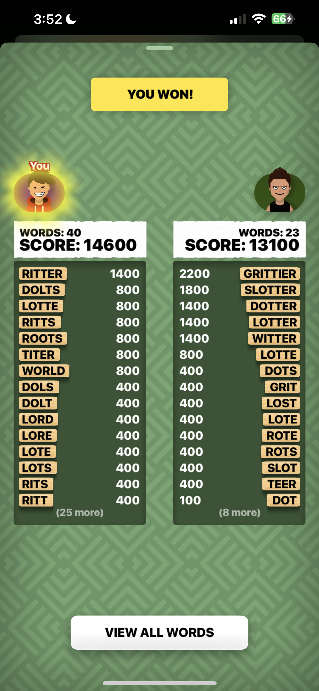

# Word Hunt Analysis

I wanted to actually analyze, learn from, and predict my Word Hunt games against my friends — not just eyeball the results screen after each match and move on. This repo is that project: 116 games against one opponent, 51 against a second, then a third batch of 63 more games against the first opponent again after I deliberately changed strategy — 230 games total, going from raw screenshot extraction all the way to regression modeling and a head-to-head skill comparison.

**Start here:** [`Insights & Summaries/word_hunt_summary.md`](Insights%20%26%20Summaries/word_hunt_summary.md) — the full story in the order it unfolded. Or jump straight to [`word_hunt_insights_combined.md`](Insights%20%26%20Summaries/word_hunt_insights_combined.md) for every individual finding, simplest to most involved.

**Try it live:** a [win-probability predictor](https://claude.ai/code/artifact/b58cd745-03d4-4486-87ea-a22224edea2a) built from the models below — enter a game in progress and it estimates your win chance, plus shows how each stat compares to your own history.

*(One example results screen, included just so the raw material makes sense — the rest of the 230 screenshots aren't included here, only the extracted data.)*

## How Word Hunt works

Word Hunt is a head-to-head word game played over iMessage via the GamePigeon extension. Both players get the same randomly-generated 4×4 grid of letters and a fixed **80-second timer**. You form words by dragging across adjacent letters (including diagonals) — no letter can be reused within the same word, and the shortest valid word is 3 letters. Both players search the identical board at the same time, entirely independently; whoever ends with the higher score wins.

Scoring is **based purely on word length**, not letter rarity (unlike Scrabble — a Q is worth the same as an E here):

| Word length | Points |
|---|---|
| 3 letters | 100 |
| 4 letters | 400 |
| 5 letters | 800 |
| 6 letters | 1,400 |
| 7 letters | 1,800 |
| 8 letters | 2,200 |
| 9+ letters | +400 per additional letter |

That scoring curve is the reason one of this project's sharpest findings exists: 6+ letter words (the ≥1400 tier) are worth disproportionately more than short ones, but they're also much rarer to spot on a 4×4 board under time pressure — so a player who's simply better at finding *long* words gets rewarded heavily, independent of how many total words either side finds. Every "word value," "tier," and "≥1400" reference throughout this repo's docs and CSVs is describing exactly this scoring table.

*(Sources: [thewordfinder.com](https://www.thewordfinder.com/word-hunt-solver/), [Word Hunt: Cracking the Code (Medium)](https://medium.com/@abhay.khanna_37314/word-hunt-cracking-the-code-9344188b1edb), [dcode.fr Word Hunt solver](https://www.dcode.fr/word-hunt-game-pigeon-solver).)*

## What's here

Raw screenshots aren't included (personal photos, not analysis output) — one example above just for context, everything else is the extracted data and what's built on top of it.

### `Insights & Summaries/`
Exactly three documents, each with a different job:
- **`word_hunt_summary.md`** — the narrative: how the data came in, why the first opponent was winning, what turned out to explain it, what changed against a second opponent, what held up, the strategy change and its result, and an honest read on how well any of this can be predicted.
- **`word_hunt_insights_combined.md`** — every individual finding from the whole project in one place, ordered from simplest to most involved.
- **`word_hunt_process_log.md`** — the methodology: every extraction pass, every derived column, every model, with the actual Python behind each step, and the mistakes caught along the way (a sign error in a hand-rolled logistic regression, a flawed apples-to-oranges comparison, a model that got *worse* with more data).

Only these three files live here — every CSV, including the simple regression fits, is under `Stats/` or `Regressions/` instead.

### `Stats/`
The working datasets and summary tables (all pandas-ready CSVs):
- `word_hunt_stats.csv` / `_stats2.csv` / `_stats3.csv` — raw extracted per-game data
- `word_hunt_data_enriched.csv` / `_enriched2.csv` / `_enriched3.csv` / `_combined.csv` — enriched with derived metrics (score/word differentials, average word value, high-value word rate, adjusted points, etc.)
- `word_hunt_summary_overall*.csv`, `_by_result*.csv`, `_by_total_score_bucket*.csv` (plus opponent-1-all and all-opponents combined versions), `_by_my_score_bucket_all_opponents.csv` — grouped averages
- `word_hunt_summary_by_player.csv` — the fair three-way comparison (me vs. each opponent, matchup by matchup)
- `word_hunt_winrate_by_word_value_*.csv`, `_by_hv_rate_sign*.csv` — win rate split by word-value and high-value-rate differentials
- `word_hunt_points_origin_decomposition.csv` / `_per_game.csv` — the tier-by-tier point breakdown behind the headline finding
- `word_hunt_insight_correlation_leaderboard*.csv`, `_opponent_tiers*.csv` — correlation ranking and opponent-strength segmentation
- `word_hunt_dataset1_vs_dataset3_own_stats_comparison.csv` — the before/after strategy-change test

### `Regressions/`
Model fits and their evaluation, including several dead ends kept for the record:
- `word_hunt_regression_words_vs_score*.csv` — simple words→score OLS fits (mine/opponent's/total), one per dataset
- `word_hunt_win_regression_*` — linear regression predicting win/loss (flagged as the wrong tool for a binary target, kept for comparison)
- `word_hunt_win_logistic_*` — logistic regression predicting win/loss, hand-rolled via Newton-Raphson (no sklearn available in the working environment)
- `word_hunt_win_logistic_cv_*` — pooled, 5-fold cross-validated versions, evaluated on all games at once instead of a single train/test split
- `word_hunt_win_logistic_predictor_v2_*`, `_score_opponent_*`, `_score_only_*` — the simpler two-feature (and one-feature) models that ended up outperforming the richer ones once the full 230-game dataset was in, and that the live predictor tool actually runs on
- `word_hunt_win_logistic_cv_score_opponent_hvrate_comparison.csv`, `_score_only_split_comparison_*` — the robustness checks (different fold seeds, different split ratios) behind that conclusion

## Method notes worth knowing before trusting a number here

- Word point values were extracted by reading each screenshot's results screen (only the numeric point value next to each word, never the word text itself). A handful of games have `_over_800` counts flagged as **lower bounds** rather than exact — the results screen only shows the top ~15 words per column, and a few games had 15+ words all worth ≥800 with more hidden off-screen.
- Two win-prediction approaches exist throughout: **linear regression thresholded at 0.5** (not the statistically correct tool for a binary target, kept for comparison) and **logistic regression** (the correct tool, and what the live predictor runs). Prefer the logistic numbers.
- Sample size matters more than it might seem: a 51-game single-split model badly overfit (86% train vs. 59% test accuracy); a richer multi-feature model that worked reasonably on 167 games actually got *worse* under cross-validation once 63 more games were added, because the added games came from a period after a real strategy change. Cross-validation, and checking a result on more than one fold assignment, is treated as the trustworthy standard throughout — single train/test splits are shown alongside it mainly to demonstrate how noisy they can be.
